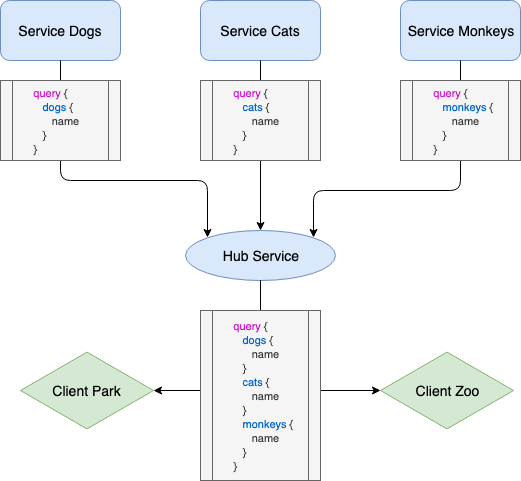
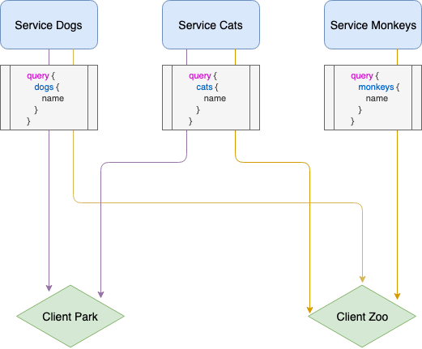

**GraphQL** now takes a big part in the industry as well as **micro-services** architecture which is also becoming a reference. Now, the usual way of dealing with these two ideas is to have a single endpoint where clients can fetch data from different services. However, this requires to have a service that merge all the schemas of the all the micro-services to be able to serve them to the client by one single graphql endpoint.

At Habx, we didn't want to have a specific service for that so we use another way that worked but could be weird at first: the **client** is charge of fetching the right data from the right service.

## The usual way

The usal way of dealing with graphql micro services is to have one service that make requests to the other services

<div style="padding: 32px">
    
</div> 


## Without hub service

In our case, each client is responsible for its data fetching meaning that for each request, the client has to know where it should query.
<div style="padding: 32px">
    
</div> 

#### Why no hub service ?

- Avoid single point of *failure* ❌
- Reduce request *time* ⏱
- Reduce architecture *cost* 💰
- Services are totally *standalone* 👍

---------- 
## How to manage this architecture client side with Apollo client ?

Apollo client lets us building the `ApolloClient` class with [links](https://www.apollographql.com/docs/link/) and we can **compose** them


Then you can use the context of Apollo to redirect your request and specify which service to request.
```js
const { data, loading } = useQuery(catsQuery, {
    context: {
      api: 'cats',
    },
  })
```
To do so, we created a factory 🏭
```js
import { split } from 'apollo-link'

const buildLinks = links =>
  reduce(
    links,
    (acc, link, apiName) => {
      if (!acc) {
        return link
      }

      return split(
        operation => operation.getContext().api === apiName,
        link,
        acc
      )
    },
    undefined
  )
```

And we list all of our services

```js
import { createHttpLink } from 'apollo-link-http'

const links = {
    cats: createHttpLink({
      uri: 'https://cats.fr/graphql',
      credentials: defaultCredentials,
    }),
    dogs: createHttpLink({
      uri: 'https://dogs.fr/graphql',
      credentials: defaultCredentials,
    }),
    monkeys: createHttpLink({
      uri: 'https://monkeys.fr/graphql',
      credentials: defaultCredentials,
    }),
    ...
  }
```
<br/>And finally we can create the `ApolloClient` 🎉<br/><br/>
```js
  new ApolloClient({
    link: buildLinks(links),
    cache: new InMemoryCache(),
  })
```


---------

## Going further

Sometimes all of your services are not in graphql, you still have the legacy **REST** API 😩 <br/>
In that case, you can use [apollo rest](https://www.apollographql.com/docs/link/links/rest/) combined with what we already had compose ! 🚀

```js
import { RestLink } from 'apollo-link-rest'

const createRestLink = ({ uri, credentials }) =>
  new RestLink({
    uri,
    headers: {
      'Content-Type': 'application/json',
    },
    credentials: credentials,
    defaultSerializer: (data, headers) => ({
      body: JSON.stringify(data),
      headers,
    }),
    typePatcher: {},
  })

```

And we can add in our list

```js
import { createHttpLink } from 'apollo-link-http'

const links = {
    cats: createHttpLink({
      uri: 'https://cats.fr/graphql',
      credentials: defaultCredentials,
    }),
    dogs: createHttpLink({
      uri: 'https://dogs.fr/graphql',
      credentials: defaultCredentials,
    }),
    monkeys: createHttpLink({
      uri: 'https://monkeys.fr/graphql',
      credentials: defaultCredentials,
    }),
    // highlight-start
    donkeys: createRestLink({
      uri: 'https://donkeys.fr/rest',
      credentials: defaultCredentials,
    }),
    // highlight-end
    ...
  }
```

## Conclusion

This method of data fetching can be discussed but it allows every service to be standalone and developers can do what they want without breaking other services.  
