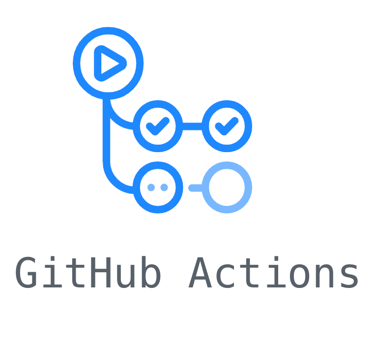

E2E testing is painful, especially when the company move fast and the UI changes all the time. However, our products need to remain usable in term of UI and UX so how to **automate** the E2E tests process for UI and scenario ?
There are tools like [cypress.io](https://www.cypress.io/) of [puppeteer](https://github.com/GoogleChrome/puppeteer) but the issue with this kind of tool is that there are based on chrome headless and cannot assure you that the code which is tested is compatible across browsers.<br/>
At Habx we wanted to keep this browsers compatibility while testing interactions **scenarios** and **UI regression**.<br/>
We choose to develop a script based on [nightwatch](https://nightwatchjs.org) that calls [browserstack](https://www.browserstack.com/) API to ensure browsers compatibility. Each test is reported through [slack](https://slack.com/intl/fr-fr/) and tests are ran **periodically** using [github actions](https://github.com/features/actions). 

<table style="width: 800px;margin: 0 auto;">
   <tbody>
        <tr>
            <td style="padding: 0 32px">
                
            </td>
            <td style="padding: 0 32px">
                
            </td>
            <td style="padding: 0 32px">
                
            </td>
            <td style="padding: 0 32px">
                
            </td>
        </tr>
    </tbody>
</table>

We released [nightwatchX](https://github.com/habx/nightwatchx), a nightwatch under steroïd 🦉.

To run the script, you need to have access to [browserstack](https://www.browserstack.com/), [Slack API](https://api.slack.com/) and [AWS S3](https://aws.amazon.com/fr/s3/).
# Description

## Install
``` shell
# in your project (better if you want to use some of our code for tests)
npm i @habx/nightwatchx

# globaly, you handle tests writing on your own
npm i -g @habx/nightwatchx
```

## Usage

### Build

``` shell
# build tests
npx nightwatchx build

# build local tests
npx nightwatchx build local
```
### Test
```bash
# run your tests
npx nightwatchx test

# run specific tests
npx nightwatchx test --only=login

# run on a local chromium
npm run  test:local --only=login
```

### Options
| param   |   description |
|----------|------|
| only     |  run only specified test suites|
| silent   | do not send slack message|
| local   | use the local config that uses a local chromium|

## How tests are ran ?

There are 4 levels of configuration
```bash
├─ test suites/folders
│   ├─ runs <--- defined in `manifest.json` per test
│   │   ├─ environments <--- list of options defined in `environments.ts` (in our case it contains the url [prod/staging/dev]) 
│   │   │   ├─ devices <--- list of options defined in `devices.ts`
 ```
  
### UI regression

UI regression tests are made with [pixelmatch](https://github.com/mapbox/pixelmatch) and files are uploaded to AWS S3
  
## Test suite config

Each test suite should be associated with a `manifest.json` file. The later contains the configuration for the tests to be run with browserstack. The whole configuration is passed down to the globals of nightwatch

``` javascript
{
  "runs": {
    "default": {
      "environments": [ // All the environements that should be run for this test
        "prod",
        "dev"
      ]
      "devices": [ // All the devices that should be run for this test
        "win10_edge",
        "mac10.14_chrome70",
        "win10_firefox"
      ],
      "frequencyMinutes": 1440 // The frequency
    },
  },
}
```
### Run options
| option   | type | default | description |
|----------|:------:|------|------|
| environments     | array| \["default"\] | environments to run the test on
| devices     | array| \["default"\] | devices to run the test on
| frequencyMinutes     | number (in minutes)| 0 | frequency of the test
| threshold     | float | 0.2 | 

## Environment config

All the environments options should be described in the file `config/environments.json`. You could also configure specific parameters by environment for tests.
``` json
{
  "default": {
    "url": "https://www.habx.fr"
  },
  "prod": {
    "url": "https://www.habx.fr"
  },
  "prod_en": {
    "url": "https://www.habx.com/en"
  }
}


```
## Devices config

All the devices settings used by browserstack should be described in the file `config/devices.json`. You could also configure specific parameters by device for tests.
[See how to configure a device for browserstack](https://www.browserstack.com/automate/nightwatch)
``` json
{
  "default": {
    "env": "chrome",
    "desiredCapabilities": {
      "browser": "chrome",
      "resolution": "1024x768",
      "browser_version": "74.0",
      "os": "Windows",
      "os_version": "10"
    }
  }
}

```
### Predefined devices

Some devices are already defined in the library:
- win10_chrome74
- win10_firefox66
- win10_edge18
- win10_ie11
- android_samsungS9
- ios_iphoneX

## Slack integration

A slack message is sent at each run. It contains a summary of the run and its potential errors or warnings

### If everything goes well

<p align="center" style="margin: 0 20%">
  
</p>

### If a screenshot comparison exceeds the acceptable diff

- We show which device(s) failed with a ⚠️
- The first screenshot which exceeded the comparison threshold is attached to the message

<p align="center" style="margin: 0 20%">
  
</p>

### If the test suite fails

- We show which device(s) failed with a ❗️
- A screenshot of the screen just after the test failed is attached to the message

<p align="center" style="margin: 0 20%">
  
</p>


## Github action job

With this config, our tests are executed every hours and reports issues on the slack channel specified in the config
```yaml
name: Run tests

on:
  schedule:
  - cron: '0 * * * *'

jobs:
  build:

    runs-on: ubuntu-latest

    strategy:
      matrix:
        node-version: [8.x]

    steps:
    - uses: actions/checkout@v1
    - name: Use Node.js ${{ matrix.node-version }}
      uses: actions/setup-node@v1
      with:
        node-version: ${{ matrix.node-version }}
    - name: npm install, build, and test
      env:
        SLACK_HOOK: https://hooks.slack.com/services/*****
        SLACK_HOOK_ERROR_ONLY: https://hooks.slack.com/services/****
        AWS_ACCESS_KEY_ID: *******
        AWS_ACCOUNT_ID: *******
        AWS_REGION: eu-west-1
        AWS_SECRET_ACCESS_KEY: ${{ secrets.AWS_SECRET_ACCESS_KEY }}
        BROWSERSTACK_ACCESS_KEY: ${{ secrets.BROWSERSTACK_ACCESS_KEY }}
        BROWSERSTACK_USERNAME: ${{ secrets.BROWSERSTACK_USERNAME }}
        SLACK_TOKEN: ${{ secrets.SLACK_TOKEN }}

      run: |
        npm install
        npm run build
        npm run test
```

-----------

# Example of test

##### manifest.json
```json
{
  "runs": {
    "default": {
      "environments": [
        "prod"
      ],
      "devices": [
        "win10_chrome74",
        "win10_firefox66",
        "win10_edge18"
      ],
      "frequencyMinutes": 0,
      "threshold": 0.5
    },
    "mobiles": {
      "environments": [
        "prod"
      ],
      "devices": [
        "ios_iphoneX"
      ],
      "threshold": 7,
      "frequencyMinutes": 0
    }
  }
}
```
<br/><br/>
##### home.js
```js

import { classSelector, NightwatchxBrowser } from '@habx/nightwatchx'

module.exports = {
  'Go to home page' : function (browser: NightwatchxBrowser) {
    browser
      .goTo(browser.globals.url)
      .waitForElementVisible('button[title="Accept policy"]')
      .pause(1000)
      .compareScreenshot('home')
  },
  'Region listing' : function (browser: NightwatchxBrowser) {
    const RegionButton = 'div[class*="RegionSearchstyle__IconContainer"]'
    browser
      .goTo(browser.globals.url)
      .waitForElementVisible(RegionButton)
      .click(RegionButton)
      .waitForElementVisible(classSelector('RegionSearchstyle__MenuLineContainer', 'a'))
  },
}
```
